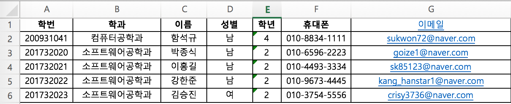

# SM345 (데이터베이스 캡스톤디자인 기말고사용)

## About

기말고사 내용

1. 사용자 등록을 엑셀로 진행합니다. (예시) 

2. 사용자 로그인을 합니다. (비밀번호는 0000 입니다.)
3. 멘토 신청을 합니다. (멘토방 생성)
4. 로그아웃 후 생성된 멘토방에 들어가 멘티 신청을 합니다.
5. 다시 멘토로 로그인해서 멘티 목록을 확인합니다.

* 로그인 후 history.push('/') 후에 mobx autorun이 작동하지 않아 페이지 새로고침을 해주어야 하는데 아직 mobx 사용이 미숙하여 참고해주세요!!

## Features

- 인증
  - 로그인
  - 사용자 등록 (엑셀)
- 멘토방 생성 (멘토 신청)
- 멘티 신청 

## Stack

- Front-End
  - axios
  - material-ui
  - mobx
  - react
  - react-router-dom

- Back-End
  - bcryptjs
  - busboy-body-parser
  - cors
  - express
  - gridfs-stream
  - jsonwebtoken
  - mongoose
  - passport
  - passport-jwt